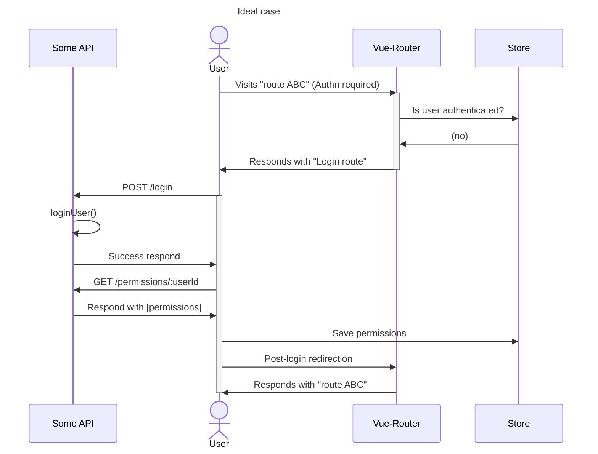

### Task 6
I understand that i don't *need* to code this, but it's was a very good opportunity for me to understand vue-router better, and i can't help myself and [gave it a go](https://github.com/lucidkodo/dagang-halal/pull/1/commits). This README is the overview of the implementation.

#### 1. Save the user permissions to Store upon login
The user permissions data should be returned upon successful authentication and saved into Store. This can be either a separate api from authentication function. Depending on DB size, combining them might free up some DB connection.

#### 2. (Selected) Routes should be protected against unauthenticated users
In this example, only the login page should be public. We can separate them with `meta` data.
```ts
  const LoginRoute: RouteRecordRaw = {
    // ...route configs...
    meta: {
      requiresAuth: false
    }
  };

const DashboardRoute: RouteRecordRaw = {
  // ...route configs...
  meta: {
    requiresAuth: true
  }
};
```

In `beforeEnter` router hook, we can check the store for an active session before allowing access.
```ts
const DashboardRoute: RouteRecordRaw = {
  // ...route configs...
  meta: {
    requiresAuth: true
  },
  beforeEnter: (next) => {
    const store = useCurrentUserStore();
    if (store.currentUser === null) next(LoginRoute) // redirects to login
    else next(); // proceed when there's sesson
  }
};
```

Or, we can have router catch alls like `router.beforeEach()` if route configs are standardized.
```ts
const router = createRouter({ ...router configs });
const isLoggedIn = getSomeBooleanValue();

router.beforeEach((to, from) => {
  if (to.meta.requiresAuth && !isLoggedIn) {
    return LoginRoute; // redirects to login
  }
})
```
#### 3. User permissions in route level
When user permissions are kept in Store, we can access the Store and verify the permissions within the `beforeEnter` hook.
```ts
const ItemDetails: RouteRecordRaw = {
  // ...route configs...
  meta: {
    requiresAuth: true
  },
  beforeEnter: (next) => {
    const store = useUserStore();
    const canEditItem = store.user.permissions.includes('Item.Edit');

    if (canEditItem) next() // proceed
    else next(FallbackRoute); // redirection
  }
};
```
> Note: The bare implementation above is a bad UX. Because unauthorized users don't get notified as to why they were redirected. To improve UX, maybe [this](https://github.com/lucidkodo/dagang-halal/pull/1/commits/b417096ccc86746842356c7f6369de57a62f6d34#diff-3b62bfb52c340d82485e1a1712ac89b98c5c8f55499990329997e0c692ac620dR56) is a better example.

#### 4. Component inputs
In Vue files, we can bind inputs, buttons, and other components to a certain permission logically. Example: A "Delete" button can be disabled to users who only have "view" permission.
```ts
// vue file

/* <script> */
const userPermissions = ['Item.View', 'Item.Edit']; // assume this is Store value
const deleteAction = 'Item.Delete';
const canDelete = userPermissions.find(p => p === deleteAction);

/* <template> */
<button :disabled="!canDelete" @click="remove">Delete</button>
```




### Submission note
1. Package changes: added dayjs, bumped vue-router version
2. Only login is persisted in browser local storage, organization data however, is not. (You'll lose progress should you reload pages.)
3. This submission is still missing: error handling, user action feedback messages, mobile responsiveness, table pagination, and missing some consistencies in handling certain scenarios.
4. There are likely uncaught bugs somewhere.
5. "Proper" 403 and 404 catch alls are not implemented. Possible runtime errors are only handled by no-ops or console logs.
6. Tho i am not happy with the outcome, but given that there were many "firsts" in this attempt, i am happy with my effort.

Thanks for your time.
